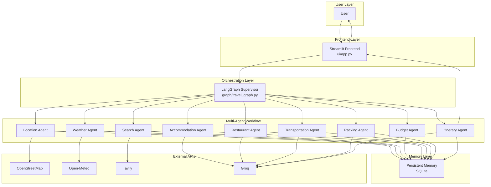
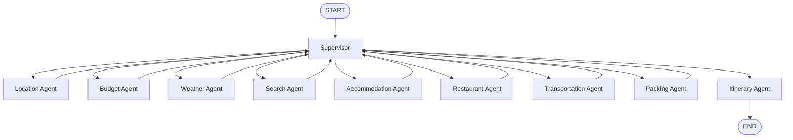

# 🧠 TravelMind AI - Multi-Agent Travel Planning Platform

[](https://www.python.org/downloads/)
[](https://github.com/langchain-ai/langgraph)
[](https://streamlit.io/)
[](LICENSE)

**TravelMind AI** is a production-ready, multi-agent AI travel planning platform that uses a **LangGraph supervisor** to orchestrate **9 specialized agents** in parallel. It plans complete trips — from location and weather to hotels, restaurants, transportation, packing, and a day-by-day itinerary — all powered by free APIs and LLMs.

---

## 📋 Project Overview

TravelMind AI transforms a simple travel request into a comprehensive, personalized trip plan. The system uses a **supervisor-based multi-agent architecture** where:

- A **LangGraph Supervisor** dynamically routes to agents based on dependencies.
- **9 specialized agents** work in parallel to gather and generate travel data.
- **Persistent memory** stores user preferences and travel history in SQLite.
- **Structured JSON output** ensures consistent, validated results.
- **Free APIs** (OpenStreetMap, Open-Meteo, Tavily, Groq) keep the platform at **zero cost**.

---

## ✨ Features

| Feature | Description |
|---------|-------------|
| 🧠 **Supervisor Agent** | Dynamically orchestrates all agents based on dependency graph |
| 🔄 **Multi-Agent Architecture** | 9 specialized agents working together |
| ⚡ **Parallel Execution** | Independent agents run simultaneously for speed |
| 📊 **Structured JSON** | Pydantic-validated outputs from every agent |
| 💾 **Persistent Memory** | SQLite-backed user preferences and travel history |
| 🎯 **User Preferences** | Personalized recommendations based on saved preferences |
| 🗺️ **Travel History** | Track all past trips per user |
| 🛡️ **Error Handling** | Graceful degradation with retry logic and error capture |
| 🔐 **Session Management** | Per-user session tracking |
| 📈 **Streamlit Dashboard** | Clean, interactive web interface |
| 💬 **Conversational AI** | Natural language trip planning |

---

## 🏗️ Architecture



See [docs/architecture.md](docs/architecture.md) for the full architecture diagram.

---

## 🔄 Workflow



The **supervisor** inspects the `completed_agents` state after each agent finishes, determines which agents have all dependencies satisfied, and routes to all ready agents **in parallel**. The graph terminates when all agents are complete.

See [docs/workflow.md](docs/workflow.md) for the full workflow diagram.

---

## 🚀 Installation

### Prerequisites

- **Python 3.10+**
- **Git** (optional, for cloning)

### Step 1: Clone the Repository

```bash
git clone https://github.com/Mukesh0416/travelmind-ai.git
cd travelmind-ai
```

### Step 2: Create a Virtual Environment

```bash
# Windows
python -m venv .venv
.venv\Scripts\activate

# macOS / Linux
python3 -m venv .venv
source .venv/bin/activate
```

### Step 3: Install Dependencies

```bash
pip install -r requirements.txt
```

### Step 4: Configure Environment Variables

Copy the example environment file and add your API keys:

```bash
cp .env.example .env
```

Edit `.env` and add your keys:

```env
OPENAI_API_KEY=your_openai_key_here
TAVILY_API_KEY=your_tavily_key_here
GROQ_API_KEY=your_groq_key_here
```

> **Note:** You only need `GROQ_API_KEY` for the LLM-powered agents. `TAVILY_API_KEY` is needed for the search agent. `OPENAI_API_KEY` is optional.

---

## ▶️ How to Run

### Run the Streamlit Dashboard (Recommended)

```bash
python run.py
```

Or directly:

```bash
streamlit run ui/app.py
```

Open your browser at: **http://localhost:8501**

### Run the FastAPI Backend

```bash
python run.py --api
```

Or directly:

```bash
uvicorn backend.main:app --reload
```

Open the API docs at: **http://localhost:8000/docs**

### Run the Test Suite

```bash
python run.py --test
```

Or directly:

```bash
pytest tests/ -v
```

---

## 📁 Project Structure

```text
TravelMind-AI
│
├── agents/                  # 9 specialized agents + supervisor
│   ├── supervisor_agent.py  # Dynamic orchestration layer
│   ├── location_agent.py    # Geocoding via OpenStreetMap
│   ├── weather_agent.py     # Weather via Open-Meteo
│   ├── search_agent.py      # Attractions via Tavily
│   ├── budget_agent.py      # Budget calculation
│   ├── accommodation_agent.py  # Hotel recommendations
│   ├── restaurant_agent.py  # Restaurant recommendations
│   ├── transportation_agent.py # Transport options
│   ├── packing_agent.py     # Packing checklist
│   └── itinerary_agent.py   # Day-by-day itinerary
│
├── graph/                   # LangGraph state and graph definition
│   ├── state.py             # Typed state with reducers
│   └── travel_graph.py      # Graph construction and execution
│
├── memory/                  # Persistent memory layer
│   └── memory.py            # SQLite-backed user memory
│
├── schemas/                 # Pydantic schemas
│   ├── agent_outputs.py     # Structured agent output models
│   └── travel_request.py    # Travel request model
│
├── services/                # Service layer
│   ├── agent_utils.py       # Logging, retry, safe execution
│   ├── sessions.py          # Session management
│   ├── trip_service.py      # Trip planning service
│   └── trip_summary.py      # Trip summary generation
│
├── sessions/                # Session data
├── tests/                   # Test suite
├── tools/                   # External API tools
│   ├── osm_tool.py          # OpenStreetMap integration
│   ├── weather_tool.py      # Open-Meteo integration
│   ├── tavily_tool.py       # Tavily search integration
│   └── budget_tool.py       # Budget calculation helper
│
├── ui/                      # Streamlit frontend
│   └── app.py               # Main dashboard
│
├── logs/                    # Application logs
├── docs/                    # Documentation
│   ├── architecture.md      # Architecture diagram
│   └── workflow.md          # Workflow diagram
├── screenshots/             # Application screenshots
│
├── .gitignore
├── requirements.txt
├── README.md
├── LICENSE
└── run.py                   # Entry point
```

---

## 🛠️ Tech Stack

| Category | Technology |
|----------|------------|
| **Language** | Python 3.10+ |
| **Orchestration** | LangGraph 0.2.60 |
| **LLM Framework** | LangChain 0.3.14 |
| **Frontend** | Streamlit 1.41.1 |
| **Backend** | FastAPI 0.115.6 |
| **LLM** | Groq (Llama 3.1) |
| **Geocoding** | OpenStreetMap Nominatim |
| **Weather** | Open-Meteo |
| **Search** | Tavily |
| **Database** | SQLite |
| **Validation** | Pydantic 2.10.4 |

---

## 🤖 Agent Descriptions

| Agent | Purpose | External API | Dependencies |
|-------|---------|--------------|--------------|
| **Supervisor** | Orchestrates all agents dynamically | None | None |
| **Location** | Resolves destination to coordinates | OpenStreetMap | None |
| **Weather** | Fetches current weather | Open-Meteo | Location |
| **Search** | Finds tourist attractions | Tavily | Location |
| **Budget** | Calculates trip budget | None | None |
| **Accommodation** | Recommends hotels | Groq | Budget, Search |
| **Restaurant** | Recommends restaurants | Groq | Budget, Search |
| **Transportation** | Recommends transport options | Groq | Location, Weather |
| **Packing** | Generates packing checklist | Groq | Weather, Transportation |
| **Itinerary** | Creates day-by-day plan | Groq | All agents |

---

## 🔌 API Integrations

### OpenStreetMap (Nominatim)
- **Purpose:** Geocoding — converts destination names to coordinates
- **Cost:** Free
- **Usage:** `tools/osm_tool.py`

### Open-Meteo
- **Purpose:** Weather data — temperature, humidity, wind speed
- **Cost:** Free
- **Usage:** `tools/weather_tool.py`

### Tavily
- **Purpose:** Web search — finds tourist attractions and travel info
- **Cost:** Free tier available
- **Usage:** `tools/tavily_tool.py`

### Groq
- **Purpose:** LLM — powers hotel, restaurant, transportation, packing, and itinerary agents
- **Cost:** Free tier available
- **Usage:** `agents/*.py`

---

## 💾 Memory Management

TravelMind AI uses **SQLite** for persistent memory with three tables:

| Table | Purpose |
|-------|---------|
| `users` | User profiles and creation timestamps |
| `preferences` | Travel style, budget range, hotel/food preferences, favorite activities |
| `travel_history` | Past trips with destination, days, budget, and timestamps |

The memory layer:
- Automatically creates the database and tables on first use.
- Uses thread-local connections for thread safety.
- Merges partial preference updates using `COALESCE`.
- Stores timestamps in ISO-8601 UTC format.

---

## 🛡️ Error Handling

The platform implements robust error handling:

- **Retry decorator** — automatically retries failed API calls (3 attempts with delay).
- **Safe execution** — agents return default values on failure instead of crashing.
- **Error accumulation** — errors are collected in the state's `errors` list.
- **Graceful degradation** — if one agent fails, the rest continue.
- **User-friendly messages** — the UI displays clear error messages.

---

## 📸 Screenshots

| Screenshot | Description |
|------------|-------------|
| [Home Page](screenshots/01_home_page.png) | Main landing page |
| [Travel Form](screenshots/02_travel_form.png) | Trip planning form |
| [Weather](screenshots/03_weather_section.png) | Weather results |
| [Attractions](screenshots/04_attractions_section.png) | Recommended attractions |
| [Hotels](screenshots/05_hotel_recommendations.png) | Hotel recommendations |
| [Restaurants](screenshots/06_restaurant_recommendations.png) | Restaurant recommendations |
| [Transportation](screenshots/07_transportation_recommendations.png) | Transport options |
| [Packing](screenshots/08_packing_recommendations.png) | Packing checklist |
| [Itinerary](screenshots/09_itinerary_page.png) | Day-by-day itinerary |
| [Travel History](screenshots/10_travel_history_page.png) | Past trips |
| [User Preferences](screenshots/11_user_preferences_page.png) | User settings |

---

## 🔮 Future Improvements

- [ ] Add multi-language support
- [ ] Integrate real-time flight and train booking APIs
- [ ] Add collaborative trip planning (share with friends)
- [ ] Implement image-based destination discovery
- [ ] Add offline mode with cached data
- [ ] Support more LLM providers (OpenAI, Anthropic, etc.)
- [ ] Add map visualization for itineraries
- [ ] Implement user authentication and profiles

---

## 📄 License

This project is licensed under the **MIT License** — see the [LICENSE](LICENSE) file for details.

---

## 👤 Author

**Mukesh**

- **GitHub:** [Mukesh0416](https://github.com/Mukesh0416)
- **Project:** [travelmind-ai](https://github.com/Mukesh0416/travelmind-ai)

---

## 🙏 Acknowledgements

- [LangGraph](https://github.com/langchain-ai/langgraph) — Multi-agent orchestration
- [LangChain](https://github.com/langchain-ai/langchain) — LLM framework
- [Streamlit](https://streamlit.io/) — Web framework
- [OpenStreetMap](https://www.openstreetmap.org/) — Free geocoding
- [Open-Meteo](https://open-meteo.com/) — Free weather API
- [Tavily](https://tavily.com/) — Search API
- [Groq](https://groq.com/) — Fast LLM inference