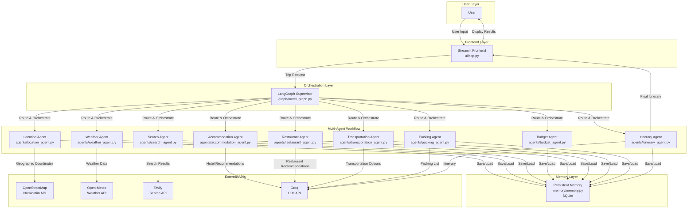

# TravelMind AI - Architecture Diagram

## Component Description

| Component | Description |
|-----------|-------------|
| **User** | The end user who interacts with the application |
| **Streamlit Frontend** | Web-based UI for trip planning, travel history, and user preferences |
| **LangGraph Supervisor** | Orchestration layer that routes agents based on dependencies |
| **Location Agent** | Resolves destination to geographic coordinates via OpenStreetMap |
| **Weather Agent** | Fetches current weather via Open-Meteo |
| **Search Agent** | Searches for tourist attractions via Tavily |
| **Budget Agent** | Calculates trip budget allocation |
| **Accommodation Agent** | Recommends hotels via Groq LLM |
| **Restaurant Agent** | Recommends restaurants via Groq LLM |
| **Transportation Agent** | Recommends transportation options via Groq LLM |
| **Packing Agent** | Generates packing checklist via Groq LLM |
| **Itinerary Agent** | Creates day-by-day itinerary via Groq LLM |
| **Memory Layer** | SQLite-backed persistent storage for user preferences and travel history |
| **OpenStreetMap** | Free geocoding API for location resolution |
| **Open-Meteo** | Free weather API |
| **Tavily** | Search API for travel information |
| **Groq** | LLM API for AI-powered recommendations |