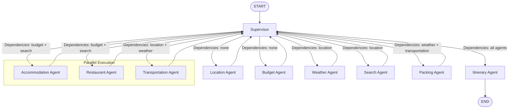

# TravelMind AI - Workflow Diagram

## Execution Flow

### Phase 1: Initial Agents (Parallel)
- **Location Agent** and **Budget Agent** have no dependencies and run first in parallel.

### Phase 2: Dependent Agents (Parallel)
- **Weather Agent** runs after Location completes.
- **Search Agent** runs after Location completes.

### Phase 3: Recommendation Agents (Parallel)
- **Accommodation Agent** runs after Budget + Search complete.
- **Restaurant Agent** runs after Budget + Search complete.
- **Transportation Agent** runs after Location + Weather complete.

### Phase 4: Packing Agent
- **Packing Agent** runs after Weather + Transportation complete.

### Phase 5: Final Itinerary
- **Itinerary Agent** runs after all other agents complete.
- The graph terminates after the Itinerary Agent finishes.

## Supervisor Orchestration

The **LangGraph Supervisor** is the central orchestration layer that:

1. Inspects the `completed_agents` state after each agent finishes.
2. Determines which agents have all their dependencies satisfied.
3. Routes to all ready agents **in parallel** using `Command(goto=[...])`.
4. Terminates the graph when all agents are complete.

### Agent Dependencies

| Agent | Dependencies |
|-------|-------------|
| Location | None |
| Budget | None |
| Weather | Location |
| Search | Location |
| Accommodation | Budget, Search |
| Restaurant | Budget, Search |
| Transportation | Location, Weather |
| Packing | Weather, Transportation |
| Itinerary | Weather, Search, Accommodation, Restaurant, Transportation, Packing |